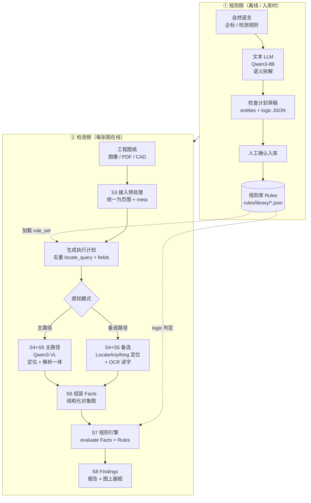
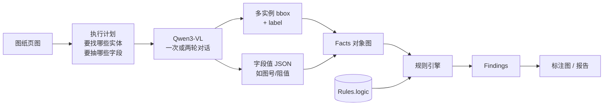
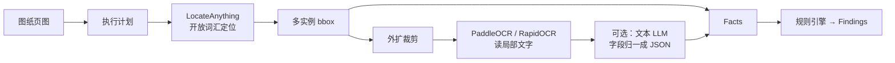
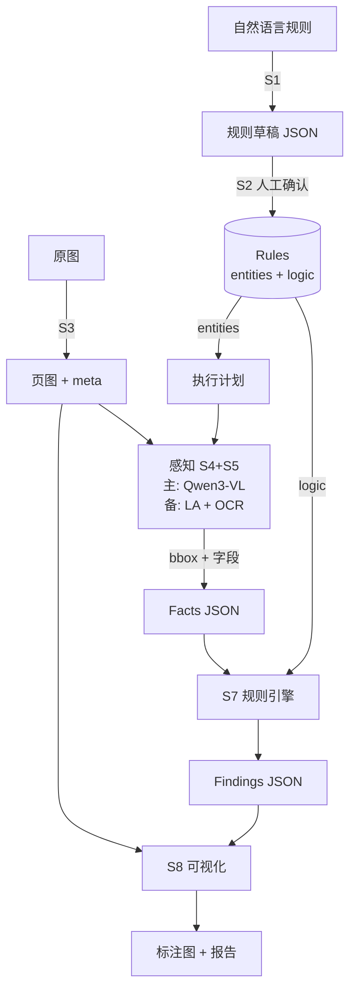
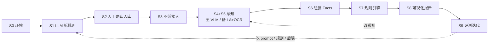

# 工程制图 AI 质检系统 — 实现流程与技术对接说明

> 目标：用户给定复杂检测规则 → 自动拆解 → 从图中定位并解析所需信息 → 规则引擎判定 → 输出带标注的结果。  
> 原则：LLM 负责理解与拆解；**主路径用通用 VLM（Qwen3-VL）一次完成定位+字段解析**；**LocateAnything + OCR 为备选感知链路**；规则引擎负责确定性终判。  
> 本文档整理自当前方案讨论，可作为落地实现清单。

---

## 1. 总体架构（流程图）

### 1.1 双轨总览：规则入库轨 + 在线检测轨



### 1.2 在线检测主路径（VLM 定位 + 解析）— 推荐默认



**主路径说明**

- 使用 **同一个 Qwen3-VL**：按执行计划找出全部实体框，并读出每个实体的具体数据字段。  
- 可一次 prompt 输出 `{bbox, fields...}` 数组；也可「先定位再对裁剪区精读」两轮（更稳，仍是同一 VLM）。  
- **不经过 OCR**（主路径默认）。

### 1.3 备选感知路径（LocateAnything + OCR）



**何时切备选**

- Qwen3-VL 框不准 / 漏检多 → 定位改 LocateAnything  
- VLM 读小字不稳或要降本 → 解析改 OCR（± 文本 LLM 结构化）  
- 可配置：`perception_backend = qwen_vl | locateanything_ocr | hybrid`

### 1.4 数据如何在步骤间流动



### 1.5 模块边界（务必遵守）

| 模块 | 做什么 | 不做什么 |
|------|--------|----------|
| 文本 LLM（Qwen3-8B） | 规则 → 结构化检查计划 / 逻辑 DSL | 不看图、不做终判 |
| **主路径 VLM（Qwen3-VL）** | **定位多实例 + 解析字段数据** | 不替代规则引擎终判 |
| **备选 LocateAnything** | 开放词汇定位出框 | 不负责稳定字段抽取 |
| **备选 OCR** | 局部图像 → 文字 | 不做复杂逻辑推理 |
| 规则引擎 | Facts + Rules → Findings | 不调用大模型猜对错 |

---

## 2. 端到端步骤与对接关系

### 2.1 步骤顺序总览（实现时按此推进）



| 步骤 | 名称 | 输入 | 输出 | 下游谁用 |
|------|------|------|------|----------|
| S0 | 环境与仓库准备 | — | 可运行环境、目录骨架 | 全部 |
| S1 | 规则语义拆解 | 自然语言规则 | 检查计划 JSON（**草稿**） | S2 |
| S2 | 规则确认入库 | 草稿 JSON | **正式** Rules + 实体字典 | 执行计划 / S7 |
| S3 | 图纸接入与预处理 | 原图/PDF/CAD | 标准页图 + meta | S4+S5 |
| S4+S5 | 感知（**主：VLM 定位+解析**） | 页图 + 执行计划 | 统一 `instances[]` | S6 |
| S4+S5′ | 感知（**备：LocateAnything+OCR**） | 同上 | 同一 `instances[]` schema | S6 |
| S6 | 组装事实对象图 | `instances[]` + meta | Facts JSON | S7 |
| S7 | 规则引擎判定 | Facts + **已入库** Rules | Findings | S8 |
| S8 | 可视化与报告 | 原图 + Findings | 标注图 / 报告 JSON | 用户 |
| S9 | 评测与迭代 | 金标 + 跑批结果 | 指标；回馈规则/感知 | S1 / S4+S5 |

**关键约定**

- S1→S2 是**规则生产**（低频）；S3→S8 是**在线检图**（高频）。  
- 在线检图**不再**调用文本 LLM 拆规则；只加载 S2 已入库 Rules。  
- S4+S5 与 S4+S5′ 对外输出必须相同，S6/S7/S8 与感知后端解耦。

### 2.2 步骤间数据契约

#### A. 统一感知输出 `instances[]`（S4+S5 → S6，主/备必须一致）

```json
{
  "backend": "qwen_vl",
  "instances": [
    {
      "entity_id": "title_block",
      "instance_id": "title_block#0",
      "label": "标题栏",
      "bbox": [10, 10, 400, 120],
      "fields": {
        "part_no": "A-1001",
        "material": "45钢"
      },
      "raw_text": "图号 A-1001 材料 45钢",
      "confidence": 0.86,
      "needs_review": false
    }
  ]
}
```

#### B. 检查计划 / 规则 Rules（S1 → S2 → 执行计划 + S7）

```json
{
  "rule_id": "TB_PART_NO_REQUIRED",
  "name": "标题栏必须有图号",
  "severity": "error",
  "status": "draft",
  "entities": [
    {
      "entity_id": "title_block",
      "locate_query": "标题栏",
      "fields": [
        {"name": "part_no", "parse_hint": "图号", "required": true}
      ]
    }
  ],
  "logic": {
    "op": "not_empty",
    "path": "title_block.part_no"
  },
  "message": "标题栏缺少图号"
}
```

- `status`：`draft`（S1 产出）→ S2 确认后改为 `active` 才可被在线加载。  
- `entities` → 生成执行计划（感知用）；`logic` → 规则引擎用。  
- `path` / `entity_id` 全库统一命名。

#### C. 事实 Facts（S6 → S7）

```json
{
  "drawing_id": "demo_001",
  "meta": {"width": 3508, "height": 2480, "page": 1},
  "title_block": {
    "part_no": "A-1001",
    "material": "45钢",
    "bbox": [10, 10, 400, 120],
    "raw_text": "图号 A-1001 ..."
  },
  "components": [
    {
      "id": "R1",
      "type": "resistor",
      "value": "10k",
      "bbox": [100, 200, 140, 240],
      "raw_text": "R1 10k"
    }
  ],
  "features": [],
  "annotations": [],
  "datums": []
}
```

#### D. 发现 Findings（S7 → S8）

```json
{
  "passed": false,
  "rule_set_id": "screen_v1",
  "findings": [
    {
      "rule_id": "TB_PART_NO_REQUIRED",
      "severity": "error",
      "message": "标题栏缺少图号",
      "path": "title_block.part_no",
      "actual": null,
      "expected": "非空",
      "evidence_bboxes": [[10, 10, 400, 120]],
      "related_ids": ["title_block#0"]
    }
  ]
}
```

---

## 3. 各步骤详细实现介绍

### S0. 环境与仓库准备

| 项 | 内容 |
|----|------|
| 作用 | 搭好可跑通 M1～M4 的工程骨架与依赖 |
| 技术 | Python 3.10+、CUDA（推荐）、venv |
| 本仓库 | `itemDetection_VLM_locateAnything_v0`（已有 LocateAnything 备选定位） |
| 建议目录 | 见第 6 节 |

**实现要点**

1. 文本 LLM（Qwen3-8B）与 VLM（Qwen3-VL）**分时加载**，8～16GB 消费卡避免双模型常驻。  
2. 配置项预留：`perception_backend=qwen_vl|locateanything_ocr|hybrid`。  
3. 先落 Schema 与空目录，再拉权重。

**实现清单**

- [ ] 创建 `rules/schema/`、`engines/`、`pipeline/`、`work_dirs/{facts,vis,reports}`  
- [ ] 安装 Qwen3 / Qwen3-VL /（备选）PaddleOCR 依赖  
- [ ] 确认 LocateAnything 本地权重 `./LocateAnything-3B` 可用（备选）  

---

### S1. 规则语义拆解（文本 LLM）

| 项 | 内容 |
|----|------|
| 作用 | 把自然语言企标/规则拆成机器可执行的 `entities`（感知需求）+ `logic`（判定逻辑） |
| 模型 | **Qwen3-8B**（本地主选）；显存紧用 4B；更强用 30B-A3B-Instruct-2507 |
| 技术 | JSON Schema 约束输出；建议两段生成：先 entities/fields，再 logic |
| 代码仓库 | https://github.com/QwenLM/Qwen3 |
| 权重 | [HF Qwen3-8B](https://huggingface.co/Qwen/Qwen3-8B) / [ModelScope](https://modelscope.cn/models/Qwen/Qwen3-8B) |
| 脚本（待建） | `tools/rule_decompose.py` |

**对接**

```text
自然语言规则 + rule.schema.json
        → Qwen3-8B
        → 草稿 JSON（status=draft）
        → S2
```

**实现要点**

1. 算子白名单：`not_empty` / `eq` / `neq` / `in` / `regex` / `count_gte` / `count_lte` / `ref_exists` / `and` / `or` / `not`。  
2. 禁止输出白名单外的自定义算子。  
3. Qwen3 关闭 thinking，或使用 Instruct-2507，保证 JSON 干净。  
4. **S1 只产草稿，不直接写入 active 规则库。**

**实现清单**

- [ ] 冻结 `rules/schema/rule.schema.json`  
- [ ] 实现 `tools/rule_decompose.py`  
- [ ] Few-shot：放 2～3 条已确认规则作示例  
- [ ] 自动校验 JSON 可解析、算子合法；失败则重试或标 invalid  

---

### S2. 规则确认入库（人工闸门）

| 项 | 内容 |
|----|------|
| 作用 | 将 LLM 草稿变成**可信任、可审计、可上线**的正式规则；在线检测只读 `status=active` |
| 技术 | JSON/YAML 规则库 + schema 校验 + 版本号 `rule_set_version` |
| 模型 | 无（可选 LLM 辅助改写 `message` 文案，终审仍是人） |
| 脚本（待建） | `tools/rule_validate.py`、`tools/rule_activate.py` |

**为什么需要人工确认（不要省掉）**

| 风险 | 说明 |
|------|------|
| 逻辑拆错 | 「为空则警告」被拆成「不等于某值就报错」 |
| 命名漂移 | `part_no` / `drawing_number` 不一致，引擎与感知对不上 |
| 不可判定规则被硬编码 | 「符合设计意图」被写成伪逻辑，上线误报/空转 |
| 严重级别错误 | warn ↔ error 搞反，影响放行 |
| 责任与审计 | 质检规则需可追溯；人确认过的库优于模型临场发挥 |

说明：S2 审的是**规则条目/版本**（低频），不是每张图都人审。图检人审属于 S8 之后的业务复核（可选）。

**对接**

```text
S1 草稿（status=draft）
  → schema 自动校验
  → 人工审核清单
  → status=active 写入 rules/library/
  → 在线侧：collect_entities(rules) + rule_engine 只加载 active
```

**人工审核清单**

- [ ] `locate_query` 是否能在真实图纸上被 VLM/LocateAnything 找到  
- [ ] `fields` / `path` 是否与 Facts 字典一致  
- [ ] `logic` 是否表达原规则本意，且属于可判定范围  
- [ ] `severity`、适用图种（零件图/装配图）是否正确  
- [ ] 与已有 `rule_id` 无冲突  

**可减轻人工、但不能替代终审的手段**

- Schema + 算子白名单自动挡格式错误  
- 用 3～5 张金标图试跑新规则，看 Findings 是否离谱  
- 模板化规则（缺字段类）可走「快速通道」，新规则/高 severity 仍建议确认  

**实现清单**

- [ ] `rules/library/` 命名：`{rule_id}.json`，含 `status` / `version` / `updated_at`  
- [ ] `tools/rule_validate.py`：path 必须在 entities 中声明  
- [ ] 审核通过才 `activate`；拒绝则回退 S1 改 prompt 或手改 JSON  

---

### S3. 图纸接入与预处理

| 项 | 内容 |
|----|------|
| 作用 | 把多种输入统一成感知模块可消费的页图，并保留坐标反变换所需 meta |
| 技术 | Pillow；PDF：PyMuPDF / pdf2image；CAD（可选）DXF/导出光栅 |
| 模型 | 无 |
| 脚本（待建） | `pipeline/ingest.py` |

**对接**

```text
DWG/DXF/PDF/PNG
  → ingest
  → page_image.png + meta.json（width/height/dpi/page/scale_to_vlm）
  → S4+S5
```

若 CAD/矢量已能直接提供部分字段，可写入「预填 Facts 片段」，感知只补缺（高级优化，MVP 可不做）。

**实现清单**

- [ ] 多页 PDF 按页拆分  
- [ ] 大图缩放与 VLM 输入分辨率对齐，meta 中记录缩放比以便 bbox 还原  
- [ ] 输出路径约定：`work_dirs/ingest/{drawing_id}/`  

---

### S4+S5. 感知：定位 + 解析

对外**只暴露一种结果**：`instances[]`（见 2.2.A）。内部用 `perception_backend` 切换。

#### 主路径（默认）：Qwen3-VL 定位 + 解析一体

| 项 | 内容 |
|----|------|
| 作用 | 一次（或两轮）完成：多实例定位 + 字段数值/文本解析 |
| 模型 | **Qwen3-VL** |
| 代码仓库 | https://github.com/QwenLM/Qwen3-VL |
| 权重 | HF/ModelScope：`Qwen/Qwen3-VL-*`（按显存选型） |
| 脚本（待建） | `pipeline/perceive_qwen_vl.py` |

**推荐调用方式**

| 方式 | 流程 | 适用 |
|------|------|------|
| A 单轮 | 一图一 prompt，直接要 `[{bbox_2d, label, fields...}]` | 目标少、图清晰 |
| B 两轮 | 先 all-instances 只要框 → 裁剪 → 再精读 fields | **默认更稳** |

**对接**

```text
page_image + plan(entities, fields)
  → Qwen3-VL
  → instances[]（backend=qwen_vl）
  → S6
```

**实现清单**

- [ ] Prompt 强制 every/all + JSON 数组  
- [ ] 坐标 0–1000 ↔ 像素；两轮时裁剪可外扩 10%～20%  
- [ ] 禁止编造：字段必须来自图面可见内容  
- [ ] 按 `locate_query` 缓存，供多条规则复用  
- [ ] 解析失败实例打 `needs_review=true`  

#### 备选路径：LocateAnything 定位 + OCR 解析

| 项 | 内容 |
|----|------|
| 作用 | 主路径框不准、读字不稳或需降本时启用 |
| 定位 | LocateAnything-3B：`locateanything_worker.py` / `screen_keyword_find.py` |
| 权重 | `./LocateAnything-3B` 或 `nvidia/LocateAnything-3B` |
| 上游 | https://github.com/NVlabs/Eagle（本仓库已 vendor `eaglevl/`） |
| OCR | [PaddleOCR](https://github.com/PaddlePaddle/PaddleOCR) / [RapidOCR](https://github.com/RapidAI/RapidOCR) |
| 可选 | OCR 原文 → Qwen3-8B 归一成 `fields`（仍不看图） |
| 脚本（待建） | `pipeline/perceive_la_ocr.py` |

**对接**

```text
page_image + plan
  → LocateAnything（bbox）
  → 外扩裁剪
  → OCR（raw_text）
  → 可选文本 LLM → fields
  → instances[]（backend=locateanything_ocr，schema 与主路径相同）
  → S6
```

**实现清单**

- [ ] 输出严格对齐 2.2.A  
- [ ] OCR 置信度阈值；过低则 `needs_review`  
- [ ] 与主路径可在 `run` 中一键切换  

#### 混合 hybrid（可选）

```text
默认 Qwen3-VL；
若某 entity 0 框 / 必填字段全空 → 对该 query 回退 LocateAnything + OCR；
或：LocateAnything 出框 + Qwen3-VL 只精读裁剪图字段。
```

---

### S6. 组装事实对象图（Facts）

| 项 | 内容 |
|----|------|
| 作用 | 把 `instances[]` 收成规则引擎按 `path` 可查询的对象图 |
| 技术 | Python dict/dataclass + `facts.schema.json` 校验 |
| 模型 | 无 |
| 脚本（待建） | `pipeline/build_facts.py` |

**对接**

```text
instances[] + meta
  → build_facts
  → facts/{drawing_id}.json
  → S7
```

**实现要点**

1. `entity_id` → Facts 顶层键（如 `title_block`）；多实例则用列表（如 `components[]`）。  
2. 始终保留 `bbox` / `raw_text`，供 Findings 举证与可视化。  
3. **禁止**在本步写死依赖某个感知后端。  
4. 关系字段（`target`、`references_datum`）能抽则写；不能则留空，由规则降级或 `needs_review`。

**实现清单**

- [ ] 实现 entity→Facts 映射表（与规则字典一致）  
- [ ] schema 校验失败则中止并报错，不进入引擎  
- [ ] dump 到 `work_dirs/facts/` 便于排查  

---

### S7. 规则引擎

| 项 | 内容 |
|----|------|
| 作用 | 对 Facts 执行 **已入库 active** 规则的 `logic`，输出 Findings |
| 技术 | 自研 JSON DSL + Python 算子解释器（MVP） |
| 可选 | 决策表 YAML；复杂约束 [Z3](https://github.com/Z3Prover/z3) |
| 脚本（待建） | `engines/rule_engine.py` |

**对接**

```text
Facts + Rules(status=active)
  → evaluate()
  → Findings
  → S8
```

**最小算子**

| 算子 | 含义 |
|------|------|
| `not_empty` | 路径有值 |
| `eq` / `neq` | 相等 / 不等 |
| `in` | 属于枚举 |
| `regex` | 匹配模式 |
| `count_gte` / `count_lte` | 列表长度 |
| `ref_exists` | 引用对象是否存在 |
| `and` / `or` / `not` | 组合 |

**实现要点**

1. 确定性：相同 Facts+Rules → 相同 Findings。  
2. 不在引擎内调用 LLM/VLM。  
3. 失败项必须能从 Facts 反查 `evidence_bboxes`。  
4. 只加载 S2 激活的规则，忽略 draft。

**实现清单**

- [ ] `evaluate(facts, rules) -> findings_dict`  
- [ ] 纯单测（人造 Facts，不依赖 GPU）  
- [ ] 未知算子 / 缺 path → 明确错误，不静默跳过  

---

### S8. 可视化与报告

| 项 | 内容 |
|----|------|
| 作用 | 把 Findings 画回图纸并导出机器可读报告 |
| 技术 | Pillow / OpenCV；JSON + 可选 HTML/Markdown 报告 |
| 参考代码 | `tools/draw_screen_keyword_boxes.py` |
| 脚本（待建） | `pipeline/render_report.py` |

**对接**

```text
page_image + Findings（+ 可选 Facts）
  → 画框/云线 + 图例
  → work_dirs/vis/*.jpg
  → work_dirs/reports/*.json
```

**实现清单**

- [ ] severity 配色：error 红 / warn 橙 / info 蓝  
- [ ] 标注 `rule_id` + 短 `message`  
- [ ] 报告中附带 `perception_backend`、`rule_set_version`，便于复现  

---

### S9. 评测与迭代

| 项 | 内容 |
|----|------|
| 作用 | 量化主/备路径与规则质量，决定改 prompt、换后端还是微调 |
| 技术 | 框 Recall@IoU；字段 Exact Match；规则级 P/R；主备对比表 |
| 微调（仅必要时） | Qwen3-VL LoRA；数据为图 + 目标 JSON |
| 参考 | https://github.com/QwenLM/Qwen3-VL |

**对接（反馈环）**

```text
金标集 + run 批跑
  → 指标
  → 定位差：改 VLM prompt / 切 LocateAnything
  → 字段差：两轮精读 / 切 OCR / 改 parse_hint
  → 规则差：回 S1/S2 修正 logic
  → 系统性偏差仍在：再考虑 LoRA
```

**实现清单**

- [ ] 20～50 张金标（框 + 字段 + 应触发 rule_id）  
- [ ] 评测脚本对比 `qwen_vl` vs `locateanything_ocr`  
- [ ] 未达标前不默认上微调  

---

## 4. 推荐默认技术栈（落地版）

| 环节 | 默认选择 | 代码/权重入口 |
|------|----------|----------------|
| 规则拆解 LLM | Qwen3-8B 本地 | GitHub [Qwen3](https://github.com/QwenLM/Qwen3)；权重 [HF Qwen3-8B](https://huggingface.co/Qwen/Qwen3-8B) / [ModelScope](https://modelscope.cn/models/Qwen/Qwen3-8B) |
| **感知主路径** | **Qwen3-VL：定位 + 解析** | [Qwen3-VL](https://github.com/QwenLM/Qwen3-VL) + 对应 HF/ModelScope 权重 |
| **感知备选** | **LocateAnything + OCR** | 本仓库 `locateanything_worker.py` + `./LocateAnything-3B`；[PaddleOCR](https://github.com/PaddlePaddle/PaddleOCR) / [RapidOCR](https://github.com/RapidAI/RapidOCR) |
| 规则引擎 | 自研 JSON DSL + Python | 本仓库待建 `engines/rule_engine.py` |
| 编排 | Python pipeline | 待建 `pipeline/`（含 `perceive_qwen_vl.py` / `perceive_la_ocr.py`） |
| 可视化 | Pillow | 参考 `tools/draw_screen_keyword_boxes.py` |

**成本与策略要点**

- 规则拆解：规则**入库时**调用文本 LLM；日常检图尽量不调文本 LLM。  
- **默认走 Qwen3-VL 一条龙**；仅当框/字不准或要降本才启用 LocateAnything+OCR。  
- 定位/解析结果按 query **缓存**，多规则复用。  
- 先不微调；评测不够再 LoRA。

---

## 5. 建议实现顺序（里程碑）

### M1 — 契约与引擎（不依赖大模型）

1. 冻结 Rules / Facts / Findings 三个 JSON Schema  
2. 实现规则引擎 + 人造数据单测  
3. 实现画框报告（读 Findings 即可）  

### M2 — 感知闭环（主路径优先）

1. 接入 **Qwen3-VL**：定位 + 字段解析 → 统一 instance schema  
2. `build_facts` → 引擎 → 可视化跑通一张真图  
3. （并行）实现备选 `LocateAnything + OCR`，同一 schema 可切换  

### M3 — 规则生产

1. 接入 Qwen3-8B 规则拆解（S1，只产 `draft`）  
2. **S2 人工确认入库**（schema 校验 + 审核清单 + `activate`）  
3. 用 5～10 条真实企标规则跑通在线检测  

### M4 — 硬化

1. 金标集评测；主/备路径对比  
2. 缓存、分块、失败自动回退备选、Findings 人工复核队列  
3. （可选）CAD 通道、LoRA 微调  

---

## 6. 建议仓库目录结构

```text
itemDetection_VLM_locateAnything_v0/
├── docs/
│   └── 工程制图AI质检_实现流程.md    # 本文档
├── rules/                            # 已入库规则
│   ├── schema/
│   │   ├── rule.schema.json
│   │   ├── facts.schema.json
│   │   └── findings.schema.json
│   └── library/
├── engines/
│   └── rule_engine.py
├── pipeline/
│   ├── ingest.py
│   ├── perceive_qwen_vl.py           # 主路径：VLM 定位+解析
│   ├── perceive_la_ocr.py            # 备选：LocateAnything + OCR
│   ├── build_facts.py
│   └── run.py                  # 总入口（可切换 backend）
├── tools/
│   ├── rule_decompose.py             # S1：LLM 拆规则 → draft
│   ├── rule_validate.py              # S2：schema / path 校验
│   ├── rule_activate.py              # S2：draft → active
│   └── draw_screen_keyword_boxes.py  # 已有可视化参考
├── locateanything_worker.py          # 已有（备选定位）
├── screen_keyword_find.py            # 已有
└── work_dirs/
    ├── facts/
    ├── vis/
    └── reports/
```

---

## 7. 总入口伪流程（对接一览）

```text
run(drawing_path, rule_set_id, perception_backend="qwen_vl"):
    image, meta = ingest(drawing_path)                 # S3
    rules = load_rules(rule_set_id)                    # S2
    plan = collect_entities(rules)                     # entities 去重

    if perception_backend == "qwen_vl":                # 主路径
        instances = perceive_qwen_vl(image, plan)      # S4+S5 定位+解析
    elif perception_backend == "locateanything_ocr":   # 备选
        instances = perceive_la_ocr(image, plan)       # LocateAnything + OCR
    else:  # hybrid
        instances = perceive_qwen_vl(image, plan)
        instances = fallback_la_ocr_if_needed(instances, image, plan)

    facts = build_facts(instances, meta)               # S6
    result = rule_engine.evaluate(facts, rules)        # S7
    render(image, result.findings)                     # S8
    return result
```

规则侧单独入口：

```text
rule_decompose(natural_language_rule) -> draft_json          # S1  LLM（status=draft）
rule_validate(draft_json) -> ok / errors                     # S2  自动校验
human_review(draft_json) -> approve / reject                 # S2  人工闸门
rule_activate(approved) -> rules/library/*.json (active)     # S2  入库
```

在线检测**只加载 active 规则**，不再调用 S1。

---

## 8. 风险与边界（实现时记住）

1. **外观可区分、可结构化的错误**优先；尺寸链、投影逻辑冲突需规则+几何，不能单靠 VLM。  
2. Qwen3-VL 支持多实例定位+解析，但密集小目标可能漏检或读错 → 分块、两轮精读，或回退备选路径。  
3. 备选路径中：纯文本 LLM **不能**直接看图；必须先 OCR（或改回 VLM）。  
4. **S2 人工确认不可省**：挡的是错误规则系统性误杀/漏检；审的是规则版本，不是每张图。可用 schema/金标试跑减负，但不能用全自动激活替代终审。  
5. 主/备路径必须共用 **同一 `instances[]` → Facts schema**，规则引擎才不用改两套。  
6. 在线检图不要现场让 LLM「临场拆规则并直接判定」。  

---

## 9. 相关链接速查

| 资源 | URL |
|------|-----|
| Qwen3 代码 | https://github.com/QwenLM/Qwen3 |
| Qwen3-8B 权重 (HF) | https://huggingface.co/Qwen/Qwen3-8B |
| Qwen3-8B 权重 (ModelScope) | https://modelscope.cn/models/Qwen/Qwen3-8B |
| Qwen3-VL 代码（主路径感知） | https://github.com/QwenLM/Qwen3-VL |
| PaddleOCR（备选解析） | https://github.com/PaddlePaddle/PaddleOCR |
| RapidOCR（备选解析） | https://github.com/RapidAI/RapidOCR |
| Z3（可选） | https://github.com/Z3Prover/z3 |
| 本项目 LocateAnything（备选定位） | `locateanything_worker.py` |
| 本项目画框脚本 | `tools/draw_screen_keyword_boxes.py` |

---

文档版本：2026-08-06（第 2～3 章与架构同步：VLM 主路径、LA+OCR 备选、S2 人工确认说明）  
适用项目：`itemDetection_VLM_locateAnything_v0`
